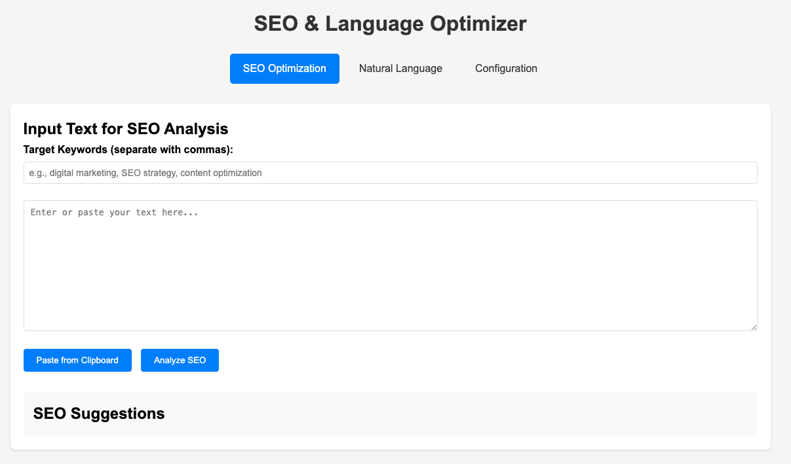

# SEO & Language Optimizer

A web-based tool that helps optimize text content for SEO and natural language improvements using AI.

## Features

### SEO Optimization
- Input text content for SEO analysis
- Specify target keywords (comma-separated)
- Get comprehensive SEO analysis including:
  - Keyword optimization and placement
  - Content structure and readability
  - Meta elements suggestions
  - Content quality assessment
  - Internal/External linking opportunities
  - Technical SEO recommendations
  - Competitor comparison

### Natural Language Improvements
- Input text for language enhancement
- Get suggestions for:
  - Writing style improvements
  - Natural alternatives for formal phrases
  - Better flow and transitions
  - More engaging expressions
  - Sentence structure variations

### Configuration
- Support for multiple AI providers:
  - OpenAI (GPT-3.5)
  - Google Gemini
  - DeepSeek
- Secure API key storage with basic encryption
- Test connection functionality
- Easy provider switching
- Configuration removal option

### Security Features
- API keys are encrypted before storing in localStorage
- Basic encryption for stored credentials
- Secure API communications

### API Integration
The application supports three AI providers:
1. OpenAI (GPT-3.5 Turbo)
2. Google Gemini
3. DeepSeek

Each provider requires its own API key and has specific request/response formats handled by the application.

## Usage

1. Configuration:
   - Click on "Configuration" in the navigation
   - Select your preferred AI provider
   - Enter your API key
   - Click "Save Configuration"
   - Use "Test Connection" to verify your setup

2. SEO Optimization:
   - Navigate to "SEO Optimization"
   - Enter your target keywords (comma-separated)
   - Input or paste your text content
   - Click "Analyze SEO"
   - Review the comprehensive SEO suggestions

3. Natural Language Improvements:
   - Navigate to "Natural Language"
   - Input or paste your text
   - Click "Analyze Language"
   - Review suggestions for making text more natural and engaging

## Technical Requirements
- Modern web browser with JavaScript enabled
- Valid API key for chosen provider
- Internet connection for API calls

## Browser Support
- Chrome (recommended)
- Firefox
- Safari
- Edge

## Notes
- API keys are stored locally in the browser
- Basic encryption is used for stored credentials
- No server-side components required
- All API calls are made directly from the browser